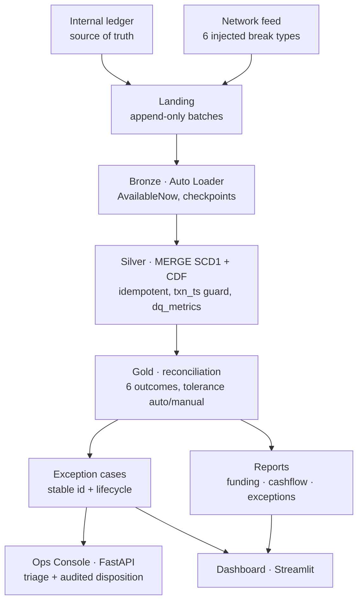
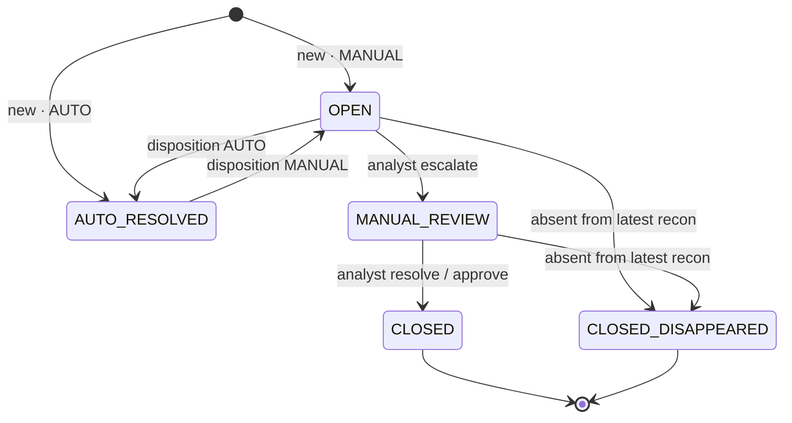
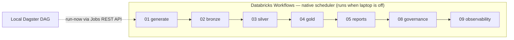
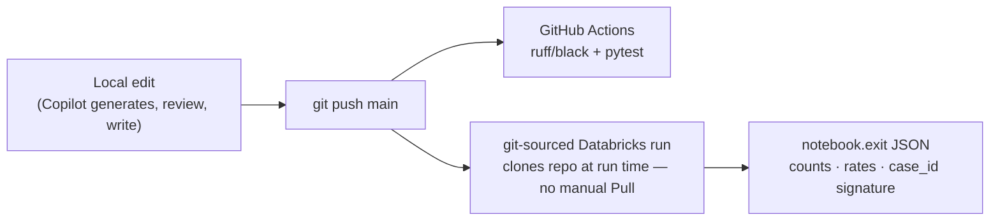
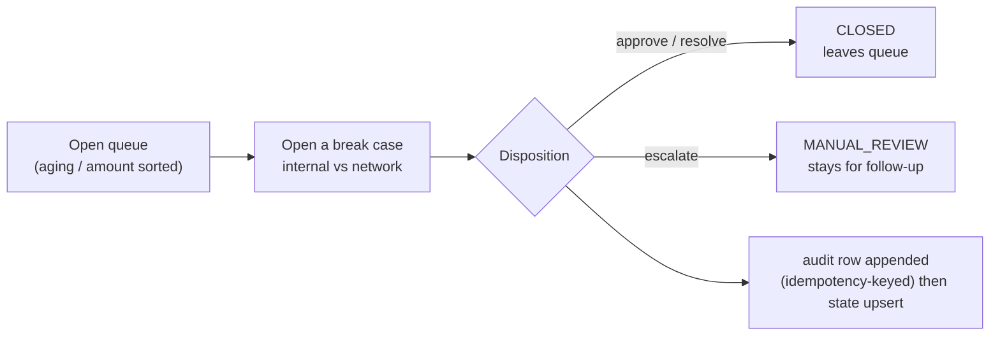

# End-to-end workflow

How the whole system fits together — data flow, the exception lifecycle, orchestration, the developer
loop, and the analyst's day. Every box below maps to committed, validated code.

## 1. Runtime data flow (medallion → serving)



1. **Generate & land** (nb01) — a deterministic internal ledger + a network feed with six disjoint
   break bands (drop, amount-manual, amount-auto, status, both, null-status) plus network-only phantoms,
   written as append-only `business_date=/batch=` CSV batches.
2. **Bronze** (nb02) — Auto Loader (`Trigger.AvailableNow`) streams the CSVs into raw Delta with
   checkpoints, schema evolution and rescued-data capture. Exactly-once ingest.
3. **Silver** (nb03) — standardize + quality-split (reject null/empty txn_id, amount ≤ 0), then
   **MERGE (SCD Type 1)** by `txn_id` with a `txn_ts` out-of-order guard; **Change Data Feed** on;
   `dq_metrics` per run. Re-running is idempotent.
4. **Gold** (nb04) — full-outer-join via the unit-tested `src/recon_logic.reconcile`, classify six
   outcomes with tolerance-based AUTO/MANUAL, then upsert exception cases with a stable identity + lifecycle.
5. **Reports** (nb05) — funding-by-channel, daily cash-flow, exception summary.
6. **Serve** — a local FastAPI **Ops Console** (analyst triage + disposition) and a Streamlit **dashboard**,
   both over an offline DuckDB snapshot of Gold.

## 2. Exception case lifecycle

`case_key = sha2(business_date | txn_id)` is stable; `case_id` and `first_seen_ts` never change. The
system only recomputes OPEN/AUTO_RESOLVED; analyst-set states are preserved. (Rules unit-tested in
`src/case_lifecycle.py` / `tests/test_case_lifecycle.py`; the notebook MERGE mirrors them.)



## 3. Orchestration



Databricks Workflows owns production scheduling (`jobs/settlement_recon_job.json`, also as an Asset
Bundle in `databricks.yml`); the local **Dagster** DAG (`orchestration/dagster/`) is a standalone control
plane that triggers the same Job via the Jobs REST API.

## 4. Developer / CI loop



The pipeline runs as a **git-sourced job**, so a push is the deploy: Databricks clones `main` at run time
and `src/` imports resolve. CI runs the unit tests (recon logic, lifecycle rules, serving) on every push.

## 5. Analyst workflow (how it's used)



## 6. Build phases (all validated on serverless)

| Phase | Delivers | Proof |
|---|---|---|
| P1 | correct engine, all 6 outcomes, single tested source of truth | run shows every outcome |
| P2 | incremental MERGE Silver + CDF + dq_metrics | re-run → identical Silver counts |
| P3 | stable `case_key` + lifecycle | `case_id` signature identical across runs |
| P4 | FastAPI Ops Console | idempotent disposition, tested |
| P5 | 1M-row scale lab + portfolio docs | ~3.4 min, correctness held |
| P6 | UC governance + data dictionary | bad insert rejected; 48-row dictionary |
| P7 | Workflows Job + Dagster DAG | Job created + ran green |
| P8 | CI + observability + IaC | run_log written; CI green |

## 7. Run it end-to-end
```bash
# Pipeline (git-sourced job): submit tasks 01→05 (+08,09) with notebook_task.source=GIT — see jobs/README.md
# Local app + dashboard:
cd serving && pip install -r requirements.txt && uvicorn app:app --reload          # http://127.0.0.1:8000
pip install -r serving/requirements-dashboard.txt && streamlit run serving/dashboard_streamlit.py
# Tests:
PYTHONPATH=. pytest -q
```
